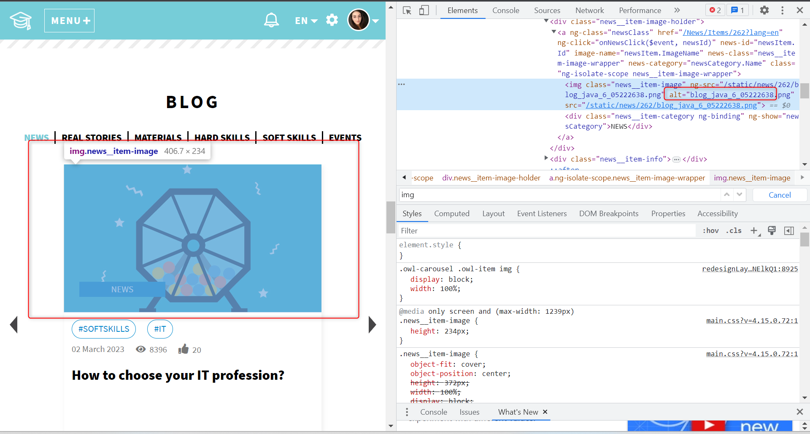

1 this inputs inside feedback form don't have lables
;
;

;

2 textarea, select should have label attribute

;
;

3 These required inputs must have the aria-required="true" attribute will cause screen readers to announce "required" along with the label text.
'Required' is an HTML attribute that is used to mark a form input field as required. When a form is submitted, the browser will prevent it from being submitted if any required fields are empty.

;

4 page doesn't have  Page regions no tags <nav>, <main>, <aside>, no 
</main> just 

5 clicking on this picture we go to news section, but this alt attribute contains unclear description, it would bs better to replace "blog_java_6_05222638.png" with "news section" or just "IT news"
;

the same with other tabs

this alt atribute doesn't provide any data related to img:

alt="2007_04485416.png"

;

6 tag a must contain href attribute, otherwise it is not good decision to take this tag
;

        Verification using Siteimprove 
this service found 13 issues

;

1 Link without a text alternative

2 Image without a text alternative 

3 Page zoom is restricted

4 Headings are not structured

5 Text not included in an ARIA landmark →

6 Container element is empty →

7 Line height is below minimum value →

8 Font size is fixed

9 Content missing after heading

10 Form field is not labeled

11 Scrollable element is not keyboard accessible

12 Color contrast does not meet enhanced requirement 

13 Color contrast does not meet minimum requirement 

        Verification using Wave
this service found many errors on the main (Home) page:
73 errors, 159 contrast errors, 83 alerts, 210 feartures
;
this service found 69 errors, 113 contrast errors, 22 alerts, 167 feartures on this page
;

        Verification using NVDA (Windows)

this sections were skiped, disabled/blind people won't able to listening this part of application

1 ;
2 ;
3 ;
unable to register, this highlihted section is skiped
4 ;